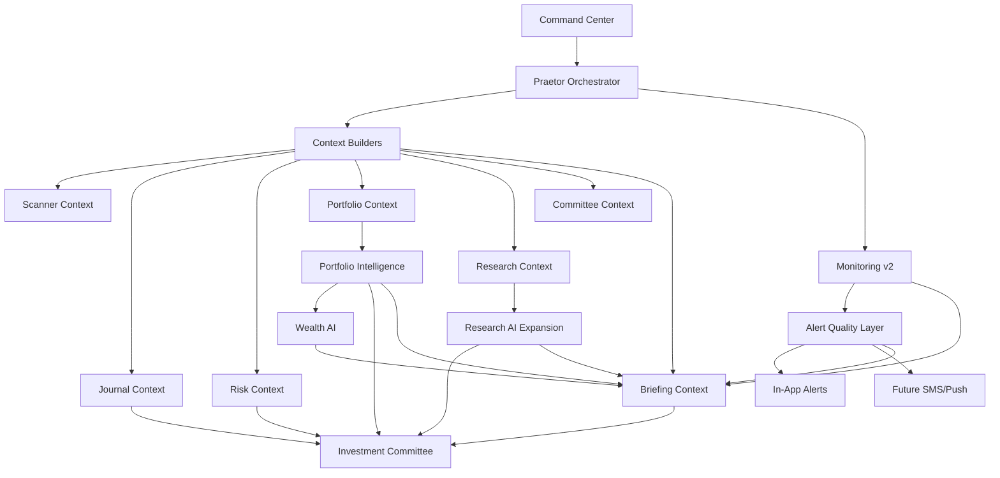

# Praetor Phase 4-7 Implementation Plan

## Goal

Move Praetor from an intelligent trading platform toward a unified financial operating system.

This plan covers the next four major phases:

- Phase 4: Active Market Intelligence
- Phase 5: Portfolio Intelligence
- Phase 6: Research AI Expansion
- Phase 7: Personal Financial Intelligence / Wealth AI

The guiding rule is: do not add disconnected AI features. Every new system must contribute back to:

- Praetor Command Center
- Recommendation of the Day
- Briefings
- Committee
- Alerts
- Global Ask Praetor

---

## Architecture Changes

### 1. Move orchestration out of `main.py`

Introduce:

```text
services/praetor_orchestrator.py
```

Purpose:

- centralize Praetor cross-module orchestration
- own command center aggregation
- own briefing context assembly
- own committee context assembly
- own monitoring flow coordination
- reduce `main.py` route bloat

Routes should eventually call service methods instead of assembling context directly.

### 2. Expand context builders

Introduce:

```text
context_builders/
  scanner_context.py
  journal_context.py
  risk_context.py
  portfolio_context.py
  research_context.py
  committee_context.py
  briefing_context.py
```

Purpose:

- standardize evidence packets
- avoid scanner-only context assumptions
- allow each Praetor module to request the context it needs
- prepare for provider/tool calling and future AI modules

### 3. Monitoring v2 foundation

Introduce:

```text
monitor_scheduler.py
```

Purpose:

- evaluate active trade plans
- detect stale plans
- track monitoring health
- build alert fingerprints
- enforce cooldown windows
- prepare for continuous Polygon polling

### 4. Alert quality layer

Extend alerts with:

- fingerprint
- cooldown_until
- last_triggered_at
- dedupe_key
- notification channel preference

This must happen before SMS/push.

---

## New Database Tables

### Phase 4

```text
monitoring_runs
notification_preferences
```

Future table candidates:

```text
monitoring_events
alert_fingerprints
watchlist_items
```

### Phase 5

```text
portfolios
positions
holdings
portfolio_snapshots
portfolio_exposures
watchlists
```

### Phase 6

```text
research_reports
research_assumptions
research_scenarios
research_provider_snapshots
```

### Phase 7

```text
financial_goals
suitability_profiles
wealth_plans
allocation_recommendations
```

---

## New Endpoints

### Phase 4

```text
GET  /api/praetor/monitor/health
POST /api/praetor/monitor/run-v2
GET  /api/praetor/notification-preferences
PATCH /api/praetor/notification-preferences
```

### Phase 5

```text
GET  /api/praetor/portfolio
POST /api/praetor/portfolio/holdings
GET  /api/praetor/portfolio/risk
POST /api/praetor/portfolio/snapshot
```

### Phase 6

```text
POST /api/praetor/research/report
GET  /api/praetor/research/reports
POST /api/praetor/research/scenario
```

### Phase 7

```text
GET  /api/praetor/wealth/profile
PATCH /api/praetor/wealth/profile
POST /api/praetor/wealth/plan
GET  /api/praetor/wealth/goals
```

---

## Dependency Map



---

## Implementation Order

### Phase 4A: Architecture cleanup

Build now:

1. `services/praetor_orchestrator.py`
2. `context_builders/` scaffolding
3. `monitor_scheduler.py`
4. monitoring health tables
5. notification preference table
6. alert dedupe/cooldown primitives

### Phase 4B: Active monitoring

Build next:

1. Polygon last-price polling
2. active plan polling
3. stale plan detection
4. alert fingerprint dedupe
5. alert cooldowns
6. command-center monitoring integration

### Phase 5: Portfolio Intelligence

Build after Monitoring v2:

1. holdings/positions
2. exposure analysis
3. concentration risk
4. position sizing warnings
5. portfolio dashboard

### Phase 6: Research AI Expansion

Build after Portfolio foundation starts:

1. research report persistence
2. scenario engine
3. AI synthesis layer
4. DCF assumptions
5. benchmarking hooks

### Phase 7: Wealth AI

Build after Portfolio + Risk + Research mature:

1. goals
2. suitability profile
3. long-term allocation framework
4. wealth committee
5. planning dashboard

---

## Rewrite Risks

### SMS before alert quality

Risk:

- duplicate noisy alerts
- poor trust
- hard-to-debug delivery behavior

Mitigation:

- build alert fingerprints, cooldowns, and notification preferences first

### Wealth AI before portfolio model

Risk:

- generic advice
- weak suitability handling
- future data model rewrite

Mitigation:

- build holdings, goals, risk profile first

### Research AI before provider/data architecture

Risk:

- fabricated or inconsistent reports
- no clear source separation

Mitigation:

- persist research inputs/assumptions/scenarios separately

### Continued orchestration in `main.py`

Risk:

- route file becomes unmaintainable
- difficult testing
- hard to add enterprise modules

Mitigation:

- move orchestration into `services/praetor_orchestrator.py`

### Context not standardized

Risk:

- each AI module gets inconsistent evidence
- future committee/briefing/wealth modules need rewrite

Mitigation:

- use context builders for every domain

---

## Current Phase 4 Start

This branch should begin Phase 4 by adding:

- `services/praetor_orchestrator.py`
- `context_builders/` scaffolding
- `monitor_scheduler.py`
- monitoring health table
- notification preferences table
- alert dedupe/cooldown fields
- monitoring health endpoint
- notification preference endpoints

Do not build:

- SMS
- Wealth AI
- Options Intelligence
- major Research AI expansion

Those depend on the foundation above.
