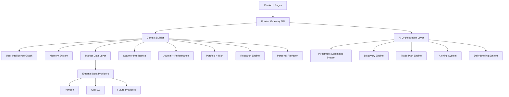
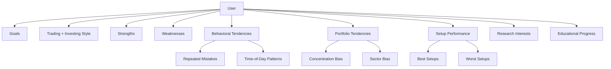
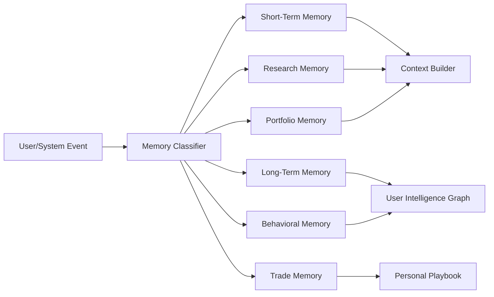
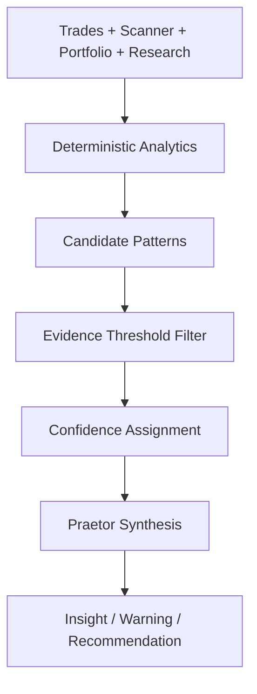
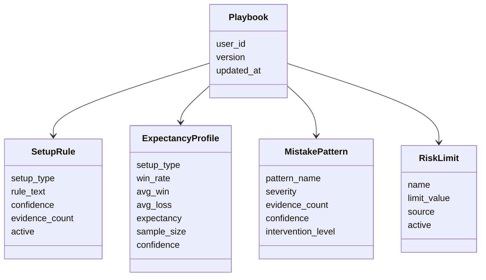
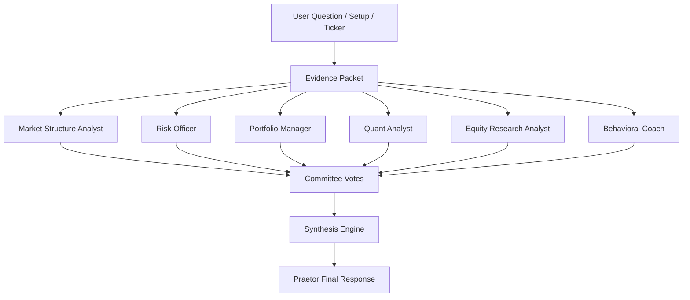
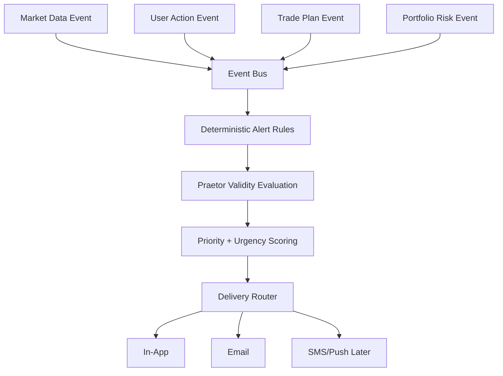

# Praetor Architecture

## Purpose

Praetor is the decision-intelligence operating system inside Cardo Praevisio.

It is not a chatbot with finance features. Praetor is an orchestration layer that combines:

- market data
- scanner intelligence
- user memory
- journal history
- portfolio context
- research workflows
- risk constraints
- AI synthesis
- visual evidence
- alerting
- personal playbook logic

Praetor's core job is to improve financial decision quality.

Prime directive:

1. Protect capital.
2. Improve decision quality.
3. Discover unseen edges.
4. Discover hidden risks.
5. Challenge bad assumptions.
6. Continuously learn the user.
7. Adapt to the user's goals.
8. Teach the user over time.
9. Prioritize signal over noise.
10. Optimize toward long-term success, not short-term engagement.

This document proposes the system architecture before implementation.

---

## 1. Praetor Core Architecture

### System View

Praetor should be designed as a modular decision-intelligence layer sitting above Cardo's data, trading, research, journal, portfolio, and alert subsystems.

### Core Service Boundaries

#### Praetor Gateway

Responsible for:

- receiving user prompts and page-specific AI requests
- identifying current page context
- identifying user intent
- enforcing permissions and plan access
- routing requests to the correct Praetor module
- returning structured responses to the UI

It should not contain business logic. It is a routing and coordination boundary.

#### Context Builder

Responsible for creating the evidence packet Praetor uses.

Inputs:

- current page
- current ticker/setup/trade/portfolio
- user account
- user memory
- recent scanner rows
- current watchlist
- journal history
- portfolio holdings
- market context
- relevant research data

Outputs:

- normalized context object
- confidence tags
- data freshness metadata
- missing-data warnings

#### AI Orchestration Layer

Responsible for:

- selecting provider/model
- selecting specialized prompt/module
- adding system rules
- controlling tool access
- handling failures
- returning structured AI output

It should be provider-agnostic and support:

- OpenAI first
- Anthropic later
- local/self-hosted models later

#### Deterministic Engines

Responsible for repeatable, testable analysis:

- scanner scoring
- portfolio risk
- trade plan math
- position sizing
- expectancy calculations
- drawdown calculations
- exposure analysis
- scenario math
- alert triggers

AI should interpret and explain deterministic results, not replace them.

---

## 2. User Intelligence Graph

The User Intelligence Graph is Praetor's model of the user.

It should distinguish between:

- facts
- inferences
- hypotheses

Every node should have:

- confidence score
- evidence source
- last updated timestamp
- decay/refresh policy
- scope
- contradiction handling

### Conceptual Graph

### Stored Node Types

#### Facts

Directly observed and highly reliable.

Examples:

- "User closed 15 imported historical trades."
- "User's best historical setup by P/L is continuation/momentum, if supported by data."
- "User entered risk tolerance as aggressive."
- "User added AAPL to portfolio."

#### Inferences

Reasonable conclusions from repeated evidence.

Examples:

- "User may overtrade low-float momentum names."
- "User performs better when waiting for confirmation."
- "User has stronger outcomes in morning sessions."

#### Hypotheses

Low-confidence patterns requiring more data.

Examples:

- "Possible biotech sector bias detected."
- "Possible tendency to chase after large gap moves."

### Confidence Model

Confidence should be stored as:

- `low`: early pattern, weak sample, limited evidence
- `medium`: repeated evidence, but not conclusive
- `high`: durable pattern across enough observations

Suggested numeric scale:

- 0.00-0.39: low
- 0.40-0.74: medium
- 0.75-1.00: high

Every belief should include:

- `belief_type`: fact | inference | hypothesis
- `confidence`
- `evidence_count`
- `supporting_records`
- `contradicting_records`
- `last_updated_at`
- `source_module`

---

## 3. Memory System

Praetor needs multiple memory classes. They should not all be stored or retrieved the same way.

### Short-Term Memory

Purpose:

- preserve current conversation/session state
- remember current ticker/setup/report/trade plan
- support follow-up questions

Retention:

- session-scoped
- optionally persisted as interaction transcript

Examples:

- "User is currently reviewing WOK."
- "User asked to simplify relative strength."
- "Current scanner row being discussed is UBXG."

### Long-Term Memory

Purpose:

- preserve durable user preferences/goals
- store learned profile traits
- power personalization

Examples:

- preferred trading style
- risk tolerance
- explanation depth preference
- favorite sectors
- avoided sectors
- typical capital range

### Behavioral Memory

Purpose:

- detect recurring mistakes
- identify emotional/behavioral patterns
- support blunt interventions

Examples:

- chasing after extended VWAP moves
- cutting winners early
- holding losers past invalidation
- oversizing high-volatility names
- trading worst time-of-day window

### Research Memory

Purpose:

- remember user research interests
- preserve prior thesis work
- track thesis changes over time

Examples:

- active thesis on NVDA
- watchlist reason for AAPL
- prior bear-case concern
- user requested macro sensitivity focus

### Portfolio Memory

Purpose:

- remember holdings and exposure tendencies
- track allocation preferences
- detect concentration risk

Examples:

- high exposure to biotech
- high cash reserve preference
- aggressive growth bias
- single-name concentration

### Trade Memory

Purpose:

- preserve executed trades
- link planned setup to actual outcome
- power playbook expectancy

Examples:

- entry quality
- exit quality
- setup tag
- reason for trade
- risk plan
- outcome
- post-trade review

---

## 4. Discovery Engine

The Discovery Engine finds patterns the user may not see.

It should not be purely AI-generated. It should combine deterministic analytics with AI synthesis.

### Discovery Types

#### Hidden Edge Detection

Find where the user appears to perform well.

Examples:

- best setup types
- best time of day
- best liquidity profiles
- best volatility regimes
- best sector/theme behavior
- best entry style

#### Hidden Risk Detection

Find patterns that quietly damage outcomes.

Examples:

- large losses after overextended entries
- weak outcomes in low-liquidity tickers
- repeated losses after midday entries
- excessive concentration
- poor results around earnings/news uncertainty

#### Behavioral Pattern Detection

Find execution and discipline tendencies.

Examples:

- chasing after a missed move
- moving stops
- oversizing after wins
- revenge trading after losses
- inconsistent journal notes after losing trades

#### Opportunity Detection

Find market opportunities aligned with the user's strengths.

Examples:

- "This setup resembles your historically strongest pattern."
- "This name meets your preferred liquidity and volatility profile."
- "This sector is showing rotation and your watchlist has multiple aligned names."

### Discovery Flow

---

## 5. Personal Playbook Engine

The Personal Playbook is the user's evolving operating manual.

It should track:

- best setups
- worst setups
- preferred entry conditions
- best times of day
- worst times of day
- highest expectancy scanner patterns
- position sizing rules
- repeated mistakes
- personal risk limits
- setup rules
- trade review notes

### Playbook Object Model

### Learning Process

1. Tag setup and intended plan.
2. Capture entry, exit, size, timing, and notes.
3. Compare intended plan vs actual execution.
4. Calculate outcome and quality metrics.
5. Update expectancy by setup/time/liquidity/volatility.
6. Update strengths, weaknesses, and mistakes.
7. Generate new playbook rules or revise old ones.
8. Assign confidence based on sample size and consistency.

### Adaptation Logic

Praetor should compare every scanner setup and trade plan against the playbook:

- setup match
- historical expectancy
- user's best entry style
- user's weakest conditions
- risk rule compatibility
- current market regime compatibility

Example output:

"This setup matches your profitable continuation pattern, but today's liquidity is weaker than your best historical trades. Treat it as a lower-conviction version unless volume improves."

---

## 6. Investment Committee System

Praetor should eventually run an internal committee of specialized analyst roles.

This should be an orchestration pattern, not separate personalities for show.

### Roles

- Market Structure Analyst
- Momentum/Scanner Analyst
- Risk Officer
- Portfolio Manager
- Equity Research Analyst
- Quant Analyst
- Macro Analyst
- Behavioral Coach

### Voting Process

Each role produces:

- view: bullish | neutral | bearish | avoid | wait
- confidence
- evidence
- risks
- missing data
- recommended next step

### Synthesis Process

Praetor should:

- summarize agreement and disagreement
- weight risk officer heavily when downside is severe
- identify missing data
- state confidence
- recommend next steps
- challenge bad assumptions when evidence supports it

---

## 7. Trade Plan Engine

The Trade Plan Engine turns scanner setups into structured, monitorable plans.

### Plan Types

#### Aggressive Plan

- earlier entry
- higher reward potential
- less confirmation
- higher risk

#### Balanced Plan

- default recommendation
- best balance of probability and reward/risk
- most users should follow this plan

#### Conservative Plan

- strongest confirmation
- lower risk
- lower reward
- suitable for risk-conscious traders

### Plan Fields

Each plan should include:

- entry zone
- trigger price
- chase threshold
- stop/invalidation
- target 1
- target 2
- target 3
- risk/reward
- confidence
- conviction
- setup grade
- historical expectancy
- playbook alignment
- key valid conditions
- invalidation conditions
- recommended monitoring rules

### Real-Time Monitoring

Praetor should evaluate whether the original plan is still valid when price reaches key levels.

Check:

- price trigger
- relative volume
- liquidity
- spread
- market structure
- VWAP/extension
- volatility
- risk/reward
- setup grade
- confidence
- conviction
- user playbook alignment
- historical user performance on similar setups
- market regime

Praetor should not blindly say "buy now" or "sell now."

It should say:

- whether conditions still support the plan
- what changed
- whether reward/risk deteriorated
- what the user should verify before acting

---

## 8. Alerting System

The Alerting System should be event-driven.

### Event Architecture

### Alert Types

- Entry Trigger Reached
- Target 1 Reached
- Target 2 Reached
- Stop/Invalidation Warning
- Setup Deterioration
- Chase Risk Warning
- Volume Fade Warning
- Liquidity Warning
- Playbook Match Alert
- Personal Risk Limit Warning

### Alert Metadata

Every alert should include:

- alert_type
- ticker
- related_plan_id
- urgency
- importance
- confidence
- evidence
- recommended next step
- whether plan remains valid
- reason if invalidated

### Prioritization

Urgency:

- immediate
- high
- normal
- low

Importance:

- critical capital protection
- trade execution
- watchlist update
- learning/coaching

Confidence:

- low
- medium
- high

---

## 9. Daily Briefing System

Praetor should deliver structured briefings.

### Morning Briefing

Purpose:

- prepare the user before market activity

Sections:

- market regime
- overnight movers
- watchlist updates
- key risk events
- portfolio exposure
- playbook reminders
- scanner themes to monitor

### Intraday Briefing

Purpose:

- update changing conditions

Sections:

- active setups
- volume/volatility changes
- sector rotation
- alerts triggered
- setups deteriorating
- risk limit status

### End-of-Day Review

Purpose:

- improve process and learning

Sections:

- trades taken
- setups watched/skipped
- plan adherence
- mistakes
- wins
- risk behavior
- tomorrow's watchlist

### Weekly Review

Purpose:

- detect patterns and update playbook

Sections:

- P/L and expectancy
- best/worst setup types
- behavior patterns
- portfolio exposure
- risk-limit performance
- updated playbook rules
- Praetor challenges and recommendations

---

## 10. AI Orchestration Layer

Praetor should be an AI orchestration system, not one monolithic prompt.

### Provider Abstraction

Initial provider:

- OpenAI

Future providers:

- Anthropic
- local/self-hosted models
- specialized research models

### Model Routing

Different jobs may use different models:

- quick scanner explanation: fast/cheap model
- institutional thesis: stronger reasoning model
- journal coaching: conversational model
- risk intervention: deterministic rules + careful AI synthesis
- portfolio stress explanation: reasoning-focused model

### Tool Calling

Praetor should call tools/modules:

- get scanner row
- get chart data
- get journal history
- get playbook
- get portfolio exposure
- get research profile
- generate chart
- evaluate trade plan
- calculate position sizing
- create alert

### AI Safety Rules

Praetor must not:

- fabricate data
- guarantee returns
- guarantee price targets
- claim certainty where data is incomplete
- hype setups
- validate unsupported user opinions

Praetor must:

- cite evidence
- state uncertainty
- identify missing data
- separate facts from inferences
- challenge when warranted
- provide alternatives

---

## 11. Database Design

This is conceptual. Tables should be introduced incrementally as features are built.

### Core Tables

#### users

Existing user account records.

#### user_memory_items

Stores facts, inferences, and hypotheses.

Fields:

- id
- user_id
- memory_type
- belief_type
- topic
- statement
- confidence
- evidence_count
- source_module
- supporting_record_ids
- contradicting_record_ids
- created_at
- updated_at
- expires_at

#### user_intelligence_edges

Graph relationships.

Fields:

- id
- user_id
- source_node_id
- target_node_id
- relationship_type
- confidence
- evidence_count
- updated_at

#### playbook_rules

Personal trading rules.

Fields:

- id
- user_id
- setup_type
- rule_text
- rule_category
- confidence
- evidence_count
- active
- created_at
- updated_at

#### setup_expectancy_profiles

Performance by setup profile.

Fields:

- id
- user_id
- setup_type
- session_window
- liquidity_bucket
- volatility_bucket
- sample_size
- win_rate
- avg_win
- avg_loss
- expectancy
- confidence
- updated_at

#### trade_plans

Structured plans generated from scanner results.

Fields:

- id
- user_id
- ticker
- source_scan_id
- setup_type
- plan_style
- entry_zone_low
- entry_zone_high
- trigger_price
- chase_threshold
- stop_price
- target_1
- target_2
- target_3
- risk_reward
- confidence
- conviction
- status
- valid_conditions
- invalidation_conditions
- created_at
- updated_at

#### trade_plan_events

Events tied to trade plans.

Fields:

- id
- trade_plan_id
- event_type
- market_snapshot
- praetor_assessment
- plan_valid
- confidence
- created_at

#### alerts

User-facing alerts.

Fields:

- id
- user_id
- alert_type
- ticker
- related_entity_type
- related_entity_id
- urgency
- importance
- confidence
- message
- evidence
- status
- delivered_at
- created_at

#### praetor_interactions

Conversation and assistant interactions.

Fields:

- id
- user_id
- page_context
- topic
- user_message
- praetor_response
- tools_used
- memory_updates
- created_at

#### briefing_runs

Generated briefings.

Fields:

- id
- user_id
- briefing_type
- content
- source_context
- created_at

### Scalability Considerations

- Start relational with JSON fields for flexible evidence payloads.
- Add indexes on `user_id`, `ticker`, `created_at`, `setup_type`, and `status`.
- Keep event tables append-only where possible.
- Separate high-frequency market data from user decision records.
- Avoid storing every tick unless needed; store snapshots tied to decisions/alerts.
- Introduce background jobs for expensive analysis.
- Introduce vector/embedding storage later for semantic memory retrieval.

---

## 12. Future Expansion

### Wealth Management

Future capabilities:

- household portfolio views
- goal-based planning
- tax-aware allocation
- risk budgeting
- multi-account aggregation
- advisor-style reporting

### Options

Future capabilities:

- options flow
- implied volatility analysis
- skew analysis
- gamma exposure
- unusual activity
- strategy builder
- options risk visualization

### Institutional Research

Future capabilities:

- analyst workflow systems
- research approval flows
- model libraries
- institutional report generation
- source citations
- earnings preview/recap workflows
- sector dashboards

### Enterprise Users

Future capabilities:

- teams
- roles/permissions
- shared workspaces
- analyst coverage lists
- institutional reporting
- audit logs
- compliance exports

---

## Implementation Phases

### Phase 1: Praetor Foundations

- AI provider abstraction
- Praetor system prompts
- context builder
- scanner "Ask Praetor" endpoint
- basic interaction logging
- chart-aware response formatting

### Phase 2: Trade Plan Engine

- save trade plan from scanner
- aggressive/balanced/conservative plans
- entry/stop/target fields
- plan status lifecycle
- manual alerts

### Phase 3: Personal Playbook

- setup tags
- playbook rules
- expectancy by setup
- repeated mistake detection
- setup-to-playbook comparison

### Phase 4: Alerting and Monitoring

- event bus
- price trigger evaluation
- plan-validity checks
- in-app alerts
- email/SMS/push later

### Phase 5: Praetor Memory Graph

- memory item tables
- confidence scoring
- facts/inferences/hypotheses
- behavioral memory
- portfolio memory
- research memory

### Phase 6: Investment Committee

- role-specific modules
- vote objects
- synthesis engine
- disagreement framework implementation

### Phase 7: Briefings

- morning briefing
- intraday briefing
- end-of-day review
- weekly playbook update

---

## Design Principle

Praetor should become the operating system for financial decision making.

It should not merely answer questions. It should:

- observe
- remember
- analyze
- challenge
- explain
- visualize
- plan
- monitor
- alert
- teach
- adapt

The architecture must preserve that ambition while still shipping practical Stage 1 improvements first.
