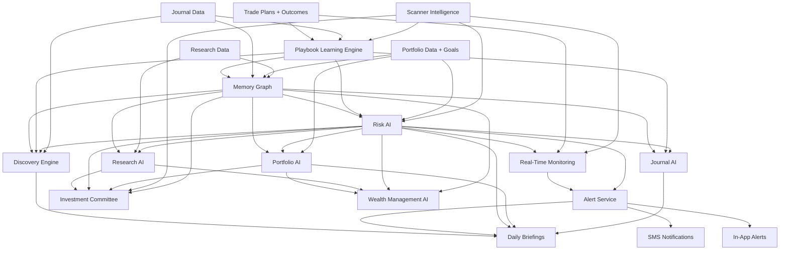
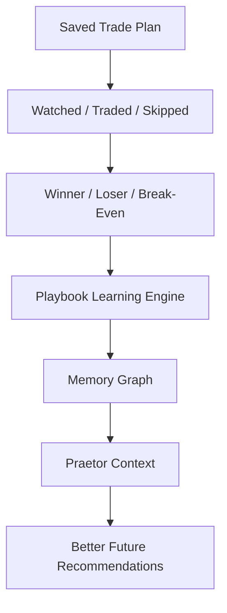

# Praetor Phase 3 Dependency Roadmap

## Purpose

This document defines the correct build sequence for the next Praetor systems so Cardo Praevisio evolves into a financial operating system rather than a collection of disconnected AI features.

Praetor should eventually include:

- Memory Graph
- Discovery Engine
- Playbook Learning Engine
- Real-Time Monitoring
- In-App Alerts
- SMS Notifications
- Daily Briefings
- Investment Committee
- Wealth Management AI
- Risk AI
- Journal AI
- Research AI

The key principle:

> Interface features like SMS, briefings, and AI chat should be powered by memory, discovery, playbook learning, user goals, and risk intelligence. They should not be built as isolated notification or chatbot features.

---

## Classification Model

### FOUNDATION

Systems that other Praetor modules depend on. These should be built early and carefully.

### MULTIPLIER

Systems that become valuable once foundation data exists. They amplify insights, personalization, and decision quality.

### INTERFACE

User-facing delivery surfaces. These should be built after enough foundation exists to make them intelligent.

---

## System Classification

| System | Classification | Why |
| --- | --- | --- |
| Memory Graph | FOUNDATION | Stores facts, inferences, hypotheses, confidence, and user intelligence. Most personalization depends on it. |
| Playbook Learning Engine | FOUNDATION | Converts trades/plans/outcomes into user-specific rules and expectancy. Required for personalized scanner/risk coaching. |
| Risk AI | FOUNDATION | Protects capital and governs challenge/intervention behavior. Should inform alerts, trade plans, journal, portfolio, and wealth modules. |
| Real-Time Monitoring | FOUNDATION | Watches plans/alerts/market state. Required before SMS or urgent alert delivery has real value. |
| In-App Alerts | FOUNDATION/INTERFACE | Foundation event records plus first UI delivery channel. Already started; must evolve into alert service. |
| Discovery Engine | MULTIPLIER | Finds hidden edges/risks once memory, journal, scanner, and playbook data exist. |
| Journal AI | MULTIPLIER | Needs trade history, outcomes, playbook rules, and memory to produce meaningful coaching. |
| Research AI | MULTIPLIER | Useful now, but becomes stronger when memory, portfolio goals, and risk context are available. |
| Investment Committee | MULTIPLIER | Depends on context, research data, risk model, memory, and portfolio goals to produce high-quality synthesis. |
| Daily Briefings | INTERFACE | Should summarize memory/discovery/risk/portfolio/scanner state. Weak if built before those systems exist. |
| SMS Notifications | INTERFACE | Should deliver high-priority alerts from monitoring/risk systems. Dangerous if built before alert prioritization exists. |
| Wealth Management AI | MULTIPLIER/INTERFACE | Needs goals, portfolio memory, risk AI, research AI, and allocation logic before it can be useful. |

---

## Dependency Graph

---

## Recommended Build Order

### Step 1: Stabilize Alert Foundation

Build now.

Why:

- In-app alerts already exist as Phase 2 foundation.
- Need a proper alert service before SMS.
- Alerts become the connective tissue between monitoring, risk, playbook, and user action.

Scope:

- alert service layer
- alert priority model
- alert status lifecycle
- alert evidence payload
- alert UI improvements
- alert repository cleanup

Do not build SMS yet.

### Step 2: Playbook Learning Engine v1

Build now.

Why:

- The first learning loop needs user decisions and outcomes to mean something.
- This is required before personalized Praetor challenges become high quality.

Scope:

- setup outcome aggregation
- expectancy by setup type
- watched/traded/skipped counts
- winner/loser/break-even stats
- playbook rule generation
- confidence scores based on sample size

### Step 3: Memory Graph v1

Build next.

Why:

- Memory Graph turns isolated events into durable user intelligence.
- Discovery, Journal AI, Risk AI, Briefings, and Wealth AI depend on it.

Scope:

- memory service
- facts/inferences/hypotheses
- confidence scoring
- evidence references
- memory retrieval by page/context
- memory update hooks from playbook and journal

### Step 4: Risk AI v1

Build after Memory Graph v1 and Playbook v1.

Why:

- Risk AI should use actual user behavior and playbook data.
- Without memory/playbook, it becomes generic advice.

Scope:

- risk profile summary
- concentration warnings
- trade-plan risk validation
- overtrading/chasing warnings
- personal risk limit framework

### Step 5: Real-Time Monitoring v1

Build after Alert Service + Risk AI foundations.

Why:

- Monitoring is only useful if it knows what conditions matter.
- It must evaluate plan validity, not just price triggers.

Scope:

- monitor saved trade plans
- evaluate entry/stop/target state
- detect chase threshold breach
- detect stale/expired plans
- create in-app alerts

No SMS until monitoring quality is reliable.

### Step 6: Journal AI v1

Build after Playbook + Memory + Risk.

Why:

- Journal AI should compare planned behavior vs actual behavior.
- It needs playbook and memory to challenge correctly.

Scope:

- post-trade review
- mistake detection
- plan adherence analysis
- repeated behavior detection
- playbook updates

### Step 7: Discovery Engine v1

Build after Playbook, Memory, Journal AI, and Risk have enough data.

Why:

- Discovery needs patterns. Without data, it fabricates weak insights.

Scope:

- hidden edge detection
- hidden risk detection
- behavioral pattern detection
- opportunity matching
- confidence-ranked discoveries

### Step 8: Daily Briefings v1

Build after Discovery + Risk + Alerts.

Why:

- Briefings should synthesize meaningful system intelligence.
- If built too early, they become generic market summaries.

Scope:

- morning briefing
- end-of-day review
- weekly review
- scanner/risk/playbook summaries
- alert digest

### Step 9: SMS Notifications v1

Build after Alert Service + Monitoring + Risk scoring.

Why:

- SMS interrupts the user. It must be reserved for high-quality alerts.
- Bad SMS alerts create noise and reduce trust.

Scope:

- notification preferences
- phone verification
- delivery provider abstraction
- urgency thresholds
- alert-to-SMS routing

### Step 10: Research AI + Investment Committee

Build after context/memory and risk layers mature.

Why:

- Research AI is already useful, but committee-grade synthesis requires full context.

Scope:

- analyst roles
- vote objects
- bull/base/bear thesis debate
- risk officer dissent
- synthesis process

### Step 11: Wealth Management AI

Build after:

- Portfolio AI
- Risk AI
- Memory Graph
- Goals
- Research AI
- Allocation logic

Why:

- Wealth AI is high responsibility. It should not exist as a generic chat wrapper.

Scope:

- user goals
- portfolio suitability
- long-term allocation
- tax/account structure later
- risk-budgeting
- planning dashboards

---

## What Can Be Built Now

These are safe to build immediately because the current Phase 1/2 foundation supports them:

1. Alert Service v1
   - move alert logic out of routes
   - prioritize alerts
   - add evidence and urgency rules

2. Playbook Learning Engine v1
   - aggregate saved plans
   - compute watched/traded/skipped counts
   - compute basic outcome stats
   - create low/medium/high confidence rules

3. Memory Graph v1
   - write facts from user actions
   - store inferences/hypotheses with confidence
   - retrieve memory for scanner/playbook context

4. Trade Plan Lifecycle Enhancements
   - expired/invalidated statuses
   - richer plan notes
   - plan event records

5. Playbook Dashboard Improvements
   - expectancy stats
   - setup profile cards
   - best/worst setup categories

---

## What Should Wait Until Memory/Playbook Learning Exists

These should not be built deeply yet:

### Daily Briefings

Wait because:

- good briefings require memory, discoveries, alerts, risk, and portfolio context
- otherwise they become generic summaries

Can build later as an interface over existing intelligence.

### SMS Notifications

Wait because:

- SMS should only send high-priority, high-confidence alerts
- premature SMS creates noise and liability

Need first:

- alert priority model
- monitoring validity checks
- risk severity scoring
- notification preferences

### Investment Committee

Wait because:

- committee roles need strong context
- otherwise it becomes multiple AI personas with weak evidence

Need first:

- research context
- risk context
- memory graph
- portfolio goals
- structured vote schema

### Wealth Management AI

Wait because:

- wealth advice needs goals, suitability, portfolio history, risk profile, and stronger compliance architecture
- should not be a generic portfolio chatbot

Need first:

- goals
- risk engine
- memory graph
- portfolio data model
- user constraints

### Discovery Engine v2+

Wait for deeper versions because:

- hidden edge detection requires enough journal/trade-plan data
- early discovery should be confidence-limited

---

## What Risks Future Rewrites If Built Too Early

### SMS before Alert Service

Risk:

- duplicated notification logic
- noisy alerts
- no prioritization
- weak user trust

Better:

- build alert service and event model first

### Daily Briefings before Memory/Discovery

Risk:

- generic market summaries
- no personalization
- later rewrite to include memory/playbook/risk

Better:

- wait until briefing inputs exist

### Investment Committee before Context Layer Matures

Risk:

- fake roleplay instead of real evidence-based synthesis
- AI personas without structured votes

Better:

- create vote schema after context builder and risk model are stronger

### Wealth AI before Goals/Risk/Portfolio Model

Risk:

- generic advice
- poor suitability handling
- future compliance/architecture rewrite

Better:

- first build goals, portfolio model, risk profile, and memory

### Discovery Engine before Enough Data

Risk:

- false patterns
- overfitting
- user distrust

Better:

- build low-confidence discovery first, promote insights only with evidence

### Journal AI before Plan/Playbook Linkage

Risk:

- generic coaching
- cannot compare intended plan vs actual behavior

Better:

- tie journal reviews to trade plans and playbook rules first

---

## Phase 3 Recommended Scope

Phase 3 should be:

## Playbook Learning Engine v1 + Memory Graph v1

This is the correct next phase because it turns Phase 2 from storage into learning.

### Phase 3 Deliverables

1. `playbook_engine.py`
   - aggregate trade plans
   - compute plan counts
   - compute outcome stats
   - calculate expectancy by setup type
   - generate initial playbook rules
   - assign confidence by sample size

2. `memory_service.py`
   - create memory facts from user actions
   - create inferences/hypotheses from playbook stats
   - retrieve memory by page/module
   - confidence scoring

3. Repository additions
   - memory repository
   - playbook repository

4. API additions
   - playbook stats endpoint
   - memory summary endpoint
   - playbook rule endpoint

5. UI additions
   - Playbook stats cards
   - initial "Praetor learned" panel
   - confidence labels
   - facts vs inferences vs hypotheses display

### Why this is the right next step

It creates the first real adaptive loop:

This must come before:

- SMS
- daily briefings
- investment committee
- wealth management AI
- advanced discovery

Because those systems should be powered by what Praetor learns.

---

## Bottom Line

Build order should be:

1. Alert Service cleanup
2. Playbook Learning Engine v1
3. Memory Graph v1
4. Risk AI v1
5. Real-Time Monitoring v1
6. Journal AI v1
7. Discovery Engine v1
8. Daily Briefings
9. SMS Notifications
10. Investment Committee
11. Research AI expansion
12. Wealth Management AI

This sequence keeps Praetor coherent.

It makes every future interface smarter because it is powered by:

- memory
- playbook learning
- user goals
- risk intelligence
- discovery
- context

That is how Praetor becomes a true financial operating system.
